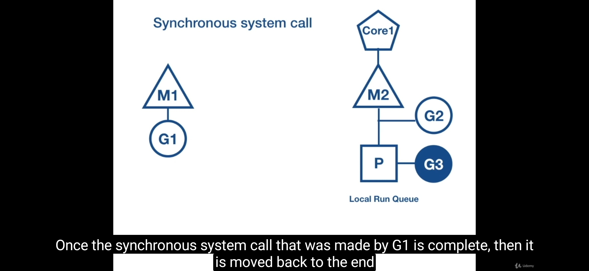
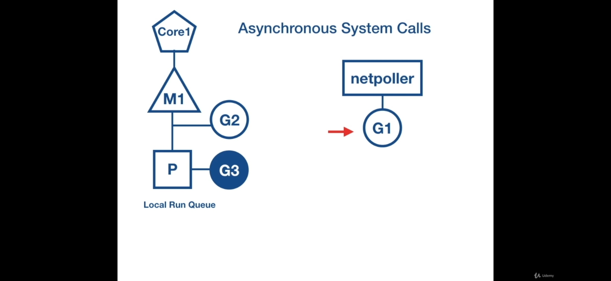
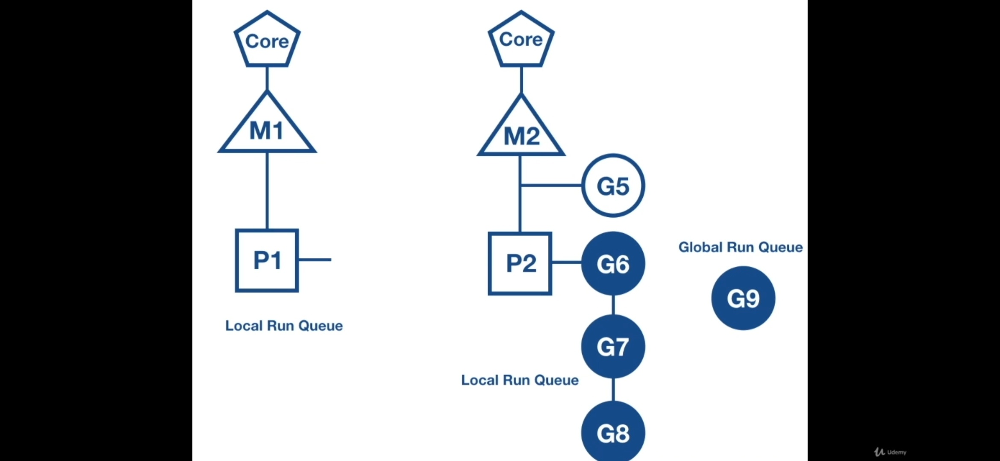
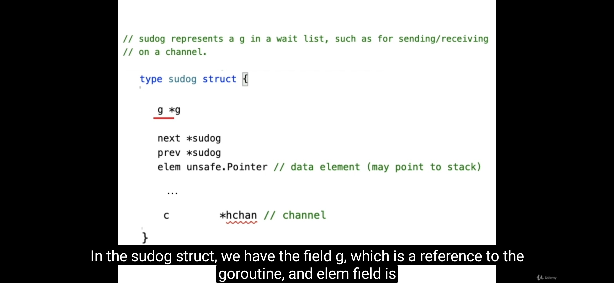
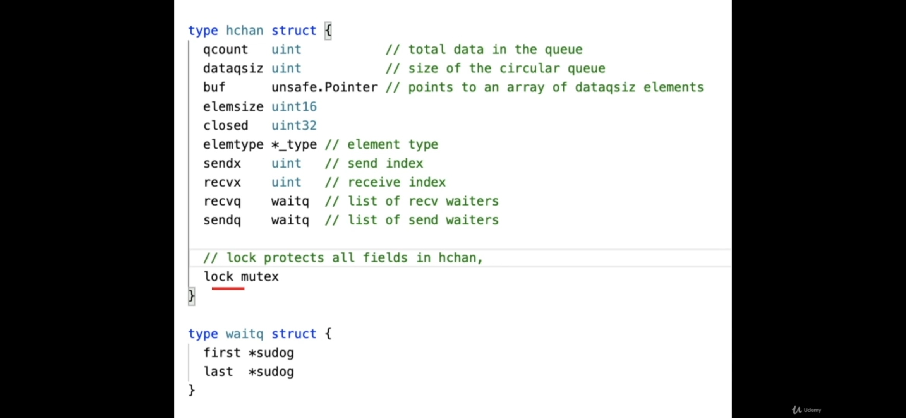

# Threads vs CPU Cores

در واقع **CPU Cores** هسته‌های فیزیکی پردازنده هستند، در حالی که **Threads** دنباله‌ای از دستورات‌اند که توسط CPU اجرا می‌شوند.  
هر **Core** می‌تواند چندین **Thread** را مدیریت کند، اما در یک لحظه فقط یکی را اجرا می‌کند.  
به این ترتیب حتی یک **Single Core** نیز می‌تواند چندین Thread را به‌صورت **غیرهمزمان (concurrent)** مدیریت کند، ولی نه به‌صورت موازی (parallel).

---

# Concurrency vs Parallelism

**Concurrency** به معنی مدیریت چند کار به طور هم‌زمان است، در حالی که **Parallelism** یعنی اجرای چند کار به طور هم‌زمان.  
در Go، ما با استفاده از **goroutine**‌ها به **Concurrency** می‌رسیم، اما اگر روی چندین Core اجرا شوند، به **Parallelism** هم دست پیدا می‌کنیم.

در Parallelism هر تسک روی یک Thread واقعی اجرا می‌شود، در حالی که در Concurrency چندین تسک می‌توانند روی یک Thread مدیریت شوند. در Concurrency ترتیب اجرای کارها اهمیتی ندارد.

**مثال:**  
تصور کنید یک نفر چند کار دارد و هر پنج دقیقه از یک کار به کار دیگر می‌پردازد — این یعنی **Concurrency**.  
اما اگر چند نفر مختلف همزمان کارهای جدا انجام دهند، این می‌شود **Parallelism**.

**مزیت Concurrency:**  
هیچ گوروتینی منتظر عملیات‌های کند (مثل شبکه یا کانال) نمی‌ماند و سیستم از زمان بهینه‌تری استفاده می‌کند.

**معایب Concurrency:**
- تست و دیباگ آن بسیار سخت است.  
- ذهن انسان به طور طبیعی خطی فکر می‌کند و درک رفتار هم‌زمانی گاهی دشوار است.  
- **Context Switching:**  
  وقتی سیستم‌عامل چندین فرآیند را مدیریت می‌کند، باید بین Threadها جابه‌جا شود. این جابه‌جایی شامل ذخیره و بازیابی وضعیت Thread است که هزینه‌ی زیادی دارد.  

در Go، Context Switching بین goroutineها توسط runtime در فضای **user space** انجام می‌شود، نه در سطح سیستم‌عامل، و به همین دلیل بسیار سبک‌تر و سریع‌تر است.

---

# مزایای Goroutine نسبت به Threadهای سیستم‌عامل

- **سبک‌تر:** استک هر Thread حدود ۸ مگابایت است، اما هر goroutine تنها حدود **۲ کیلوبایت** حافظه می‌گیرد.  
- **Context Switching سریع‌تر:** جابه‌جایی بین گوروتین‌ها هزینه‌ی بسیار کمی دارد.  
- **User Space Scheduling:** زمان‌بندی گوروتین‌ها درون user space انجام می‌شود و نیاز به system call ندارد.  

**چرا Context Switch در گوروتین‌ها ارزان‌تر است؟**
- نیازی به فراخوانی system call نیست.  
- حافظه‌ی بسیار کمتری نیاز دارد.  
- عملیات در فضای user انجام می‌شود، نه kernel.  

---

# Goroutines

گوروتین‌ها Threadهای مجازی سبکی هستند که توسط **runtime** مدیریت می‌شوند.  
به جای اینکه Threadها مستقیماً توسط سیستم‌عامل کنترل شوند، runtime آن‌ها را زمان‌بندی کرده و بین پردازنده‌ها توزیع می‌کند.

---

# Scheduler

یکی از اجزای اصلی runtime است و وظیفه‌ی مدیریت اجرای گوروتین‌ها را دارد.  
نکته مهم این است که تکنیک **M:N scheduling** (تعداد زیاد گوروتین روی تعداد محدود Thread سیستم‌عامل) با مدل **M, P, G** اشتباه گرفته نشود.

---

# M:N Scheduler

این مدل توضیح می‌دهد چگونه هزاران گوروتین می‌توانند روی چند Thread واقعی اجرا شوند.

- **M (Machine):** Threadهای واقعی سیستم‌عامل هستند.  
- **N:** تعداد محدود Threadهای سیستم‌عامل که ممکن است ۴ یا ۸ باشد (به تعداد CPU Coreها).  
- هر گوروتین (**G**) توسط runtime به یکی از Threadها (**M**) اختصاص داده می‌شود تا اجرا شود.

---

# Go's Scheduler: M, P, G Model

- **M (Machine):**  
  همان Threadهای سیستم‌عامل هستند که گوروتین‌ها روی آن‌ها اجرا می‌شوند.

- **P (Processor):**  
  پردازنده‌ی منطقی است که صفی از گوروتین‌ها را نگه می‌دارد (**local run queue**).  
  وظیفه‌ی آن مدیریت اجرای گوروتین‌ها و تحویل آن‌ها به M برای اجراست.

- **G (Goroutine):**  
  واحد اجرای سبک (user-level thread) که توسط runtime مدیریت می‌شود.

نمونه ساختار:
```
P1 -> M1
     |-> G1
     |-> G2

P2 -> M2
     |-> G3
     |-> G4
```

---

## Preemption

در زمان اجرا runtime به صورت دوره‌ای بررسی می‌کند که آیا یک گوروتین CPU را بیش از حد درگیر کرده است یا نه. اگر بله، آن را متوقف کرده و CPU را به گوروتین‌های دیگر می‌دهد.

---

## Work Stealing

اگر یک پردازنده‌ی منطقی (P) در صف خود گوروتینی برای اجرا نداشته باشد، از صف پردازنده‌های دیگر یا از **global run queue** گوروتین "می‌دزدد".  
این کار باعث توزیع عادلانه بار بین پردازنده‌ها می‌شود.

**تفاوت Work Stealing و Preemption:**  
Preemption برای جلوگیری از اشغال بیش از حد CPU است،  
در حالی که Work Stealing برای توزیع بهتر گوروتین‌ها بین صف‌های مختلف است.

---

## Goroutine States

حالت‌های مختلف گوروتین:
- **Runnable:** آماده برای اجرا  
- **Running:** در حال اجرا  
- **Waiting:** منتظر event مثل I/O یا channel  

---

## GOMAXPROCS

تعداد پردازنده‌های منطقی (P) فعال در runtime را تعیین می‌کند.  
به‌صورت پیش‌فرض برابر با تعداد هسته‌های CPU سیستم است.

---

# Deep Dive: Context Switching

زمانی که گوروتین در حال انجام I/O باشد، runtime تصمیم می‌گیرد Context Switch انجام دهد تا CPU بی‌کار نماند.

## System Call

وقتی گوروتین عملیاتی مثل خواندن فایل یا درخواست شبکه انجام می‌دهد، به سیستم‌عامل اطلاع می‌دهد تا آن را اجرا کند.

### Context Switching در Sync System Call

در این حالت، گوروتین تا زمان دریافت پاسخ از OS **بلاک** می‌شود.  
Runtime برای جلوگیری از توقف کل برنامه، گوروتین بلاک‌شده را از Thread فعلی جدا کرده و یک Thread جدید (M2) می‌سازد تا گوروتین‌های دیگر ادامه یابند.



### Context Switching در Async System Call

در حالت **async**، گوروتین منتظر پاسخ نمی‌ماند و OS با مکانیزم‌هایی مثل **epoll** یا **kqueue** بعداً با runtime تماس می‌گیرد تا اطلاع دهد که نتیجه آماده است.  

در این حالت، Go از **netpoller** استفاده می‌کند که واسطی بین runtime و epoll است.  
به این ترتیب نیازی به ایجاد Thread جدید نیست و کارها به شکل بسیار بهینه‌تری انجام می‌شود.

مرحله به مرحله خودم :


بر حلاف مورد اول ، در این مورد میشه در خواست داد و منتظر call back و یا notification بود و کار های دیگر هم ادامه داد مانند درخواست http get

در این حالت os این امکان رو میده که با epoll بفهمیم هر وقت پاسخ اومد ، بیایم ادامه بدیم

+ netpoller : 

یه اینترفیس در گولنگ است که به epoll لینوکس وصل میشه و خودش هندل میکنه گوروتین ها رو ، و جدول notif ها رو داره ، به این صورت که اگر یه گوروتین 


ترتیبش به این صورت هست که ابتدا گوروتین درون اسکجولر هست
و زمانی که بخواد منتظر epoll  لینوکس باشه ، از os thread خارج میشه و میره در netpoller
و اونجا با استفاده از file descriptor  پولینگ میکنه

در اینروش بر خلاف روش سینک ، نیاز به یک ترد دیگر نیست




---

# Work Stealing (جزئیات)

اگر یک پردازنده‌ی منطقی (P) بیکار بماند:

1. ابتدا سعی می‌کند از صف Pهای دیگر گوروتین بدزدد (نصف صف).  
2. اگر پیدا نکرد، از صف **global runnable queue** گوروتین برمی‌دارد.  
3. در نهایت اگر هیچ‌کدام نبود، از **netpoller** استفاده می‌کند تا گوروتین‌های مرتبط با I/O را بیدار کند.



---

# Deadlock, Block, SendQ, RecvQ

وقتی گوروتینی می‌خواهد از یک channel ارسال یا دریافت کند اما طرف مقابل وجود ندارد (یا buffer پر/خالی است)، گوروتین **بلاک** می‌شود و در صف **sendq** یا **recvq** قرار می‌گیرد.  
اگر هیچ گوروتینی نباشد که این بلاک را رفع کند، برنامه دچار **deadlock** می‌شود.

ساختار channel در Go شامل اجزای زیر است:
- **mutex:** برای قفل‌گذاری  
- **buf:** محل ذخیره داده‌ها (در چنل buffered)  
- **sendq / recvq:** صف گوروتین‌هایی که در حالت انتظارند  
- **sudog:** ساختاری که اطلاعات گوروتین در حال انتظار را نگه می‌دارد  



---

# gopark() و goready()

- **gopark():**  
  وقتی گوروتین نمی‌تواند ادامه دهد (مثل زمان پر بودن بافر یا نبودن گیرنده)، runtime آن را پارک کرده و به Scheduler بازمی‌گرداند.

- **goready():**  
  وقتی شرایط اجرا دوباره فراهم شد (مثلاً receiver آماده شد)، runtime گوروتین پارک‌شده را بیدار کرده و به صف اجرای Scheduler اضافه می‌کند.

---

channels underneath





هر چنل یه استراکت است و یه سری اینتیتی داره ، مهم ترین آنها
یه mutex  داره برای لاک ، یه buf  داره که آدرس داده ها هست و اگر چنل آنبافر باشه ، این خالیه ، sendq , recvq  آدرس های گوروتین ها هستن که یا نتونستن ریسیو کنن یا نتونستن سند کنن ، در حقیقت تایپشون waitq  هست و این خود یک لینکد لیست هست ،  


و sudog اطلاعات گوروتین رو نگه میداره ، elem  آدرس اون هست و g  آبجکت اون

وقتی بافر خالیه و یه گوروتین می خواد ریسیو کنه ، می ره تو لیست recvq و gopark()  رو کال میگنه.
 اسکجولر اون رو میبره ته صف لاجیکال پراسس، حالا فرض کنیم گوروتینی که توی چنل send میکنه میاد و و به recvq نگاه میکنه و direct  داده رو میده به g1 و پس از این که داده رو مستقیم گذاشت تو استک g1 سپس goready)g1( رو کال می کنه

نکته ، تنها جایی g 1 داده direct کپی میشه به stack گوروتین g2  در شرایطی هست که یا آنبافر باشه و یا recvq پر باشه


وقتی بافر پر هست و یه گوروتین میخواد send  کنه نمی تونه بجاش send gopark)(  رو کال میکنه و می ره تو لیست منتظر ها ، حال اگر یه گوروتین بخواد داده بخونه ، از بافر بر میداره ، و بعد از خالی شدن بافر ، گوروتین که پارک شده ، اجرا میشه

+ gopark()

وقتی یک goroutine نتونه جلو بره یعنی یا آنبافره و یا بافر پره - برای سند کردن- یا خالیه - برای ریسیو کردن- در این صورت ابتدا رانتایم اون گوروتین رو پارک میکنه معنی :

یعنی این گوروتین رو پارک کن و به اسکجولر برگرد و اون گوروتین میره ته صف پراسسور

+  goready()

وقتی شرایط unblock شدن فراهم شد: receiver آماده میشه برای یه sender یا buffer جا باز می‌کنه runtime با goready() اون goroutine رو از حالت پارک‌شده در میاره و می‌ذاره دوباره توی صف اجرای scheduler.


# Channels

کانال‌ها ابزار ارتباطی بین گوروتین‌ها هستند.  
از آن‌ها برای اشتراک داده بین goroutineها به‌صورت امن استفاده می‌شود.

---

## انواع Channelها

### Unbuffered Channel

- داده تنها زمانی ارسال می‌شود که گیرنده‌ای آماده باشد.  
- در صورت نبود گیرنده، sender بلاک می‌شود (و برعکس).  
- رفتار کاملاً **synchronous** دارد.  
- مناسب برای همگام‌سازی دقیق بین گوروتین‌ها.  

مثال:
```go
func main() {
    ch := make(chan int)
    go func() { ch <- 42 }()
    fmt.Println(<-ch)
}
```

### Buffered Channel

- داده‌ها تا پر شدن ظرفیت buffer ذخیره می‌شوند.  
- ارسال و دریافت می‌تواند **asynchronous** باشد.  
- زمانی مناسب است که ترتیب دریافت اهمیت ندارد یا می‌خواهیم محدودیت هم‌زمانی اعمال کنیم.  

همچنین برای هر پیام بهتر است **correlation ID** و **error** را در struct قرار دهیم تا بتوان پیام‌ها را به درخواست‌ها تطبیق داد.

---

### Directional Channels

- **send-only:** `chan<- T` — فقط ارسال داده  
- **receive-only:** `<-chan T` — فقط دریافت داده  
استفاده از این نوع چنل‌ها احتمال خطاهای هم‌زمانی را کاهش می‌دهد.

---

# جلوگیری از Deadlock

- استفاده از **directional channel**  
- طراحی معماری بدون وابستگی‌های حلقوی  
- تنظیم **Timeouts** برای عملیات I/O  
- تعیین ظرفیت مناسب buffer  
- **بستن چنل‌ها** پس از پایان کار  
- اجرای برنامه با `go run -race` برای شناسایی شرایط رقابتی  

---

# Error Handling by Channels

در حالت‌هایی که Workerها در حلقه‌ای بی‌نهایت از channel می‌خوانند، برای تشخیص اینکه هر پاسخ مربوط به کدام درخواست است، می‌توان از ساختار زیر استفاده کرد:

```go
type Response struct {
    RequestID int
    Message   string
    Error     error
}

func worker(req Request, wg *sync.WaitGroup, resCh chan<- Response)
```

با این روش می‌توان پاسخ‌ها را به‌صورت دقیق و ایمن تریس و مدیریت کرد.
