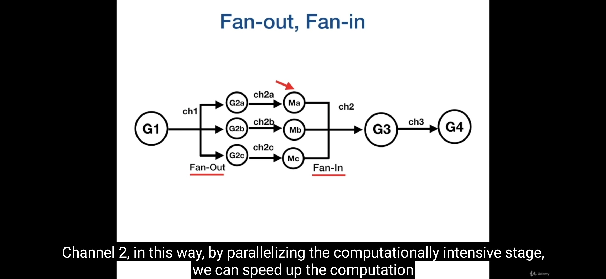
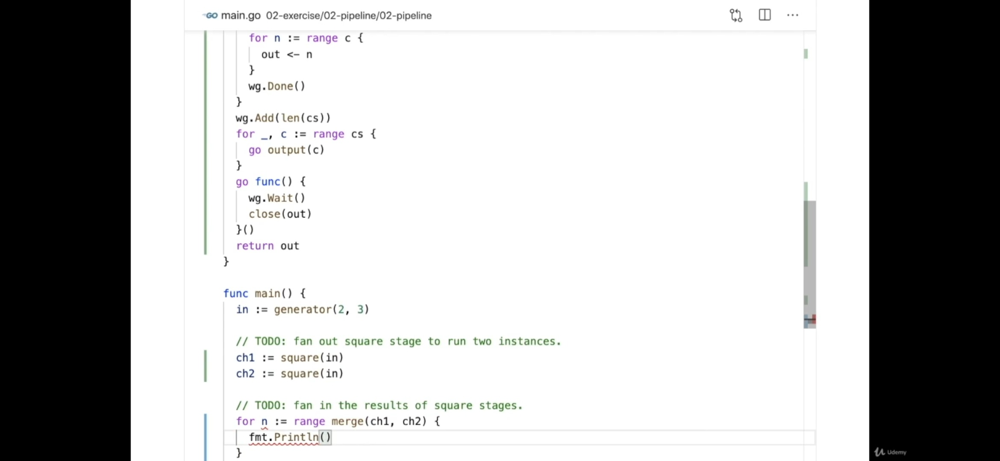

# پترن‌های هم‌زمانی در Go

در این بخش با مهم‌ترین الگوهای هم‌زمانی (Concurrency Patterns) در زبان Go آشنا می‌شویم که شامل Generator، FanIn، FanOut، Pipeline، Worker Pool و سایر الگوهای مرتبط با مدیریت گوروتین و چنل‌ها هستند.

---

## پترن Generator

در این پترن یک تابع تولیدکننده‌ی داده (Generator) داریم که یک یا چند goroutine را برای ارسال داده از طریق یک channel راه‌اندازی می‌کند.

ویژگی‌های اصلی Generator:
- ساخت channel درون generator انجام می‌شود (`make(chan ...)`)
- generator حداقل یک channel خروجی دارد (`return chan`)
- درون generator معمولاً یک goroutine وجود دارد (`go func() {...}`)
- بستن channel نیز درون generator انجام می‌شود (`close(ch)`)

هر channel می‌تواند شامل یک struct باشد که در خود `error` نیز دارد. یکی از ورودی‌های generator معمولاً یک flag یا `done` channel است. در داخل generator از `select` برای بررسی وضعیت `done` استفاده می‌شود تا در صورت لزوم عملیات متوقف گردد.

> نکته: بهتر است **مالکیت (ownership)** یک channel با تابعی باشد که در آن `write` انجام می‌دهد، و همان تابع نیز مسئول `close` کردن آن باشد.

```go
type Result struct {
	data int
	err  error
}

func handler() {
	input := []int{1, 2, 3, 4, 5, 6}

	// Explicit cancellation
	doneCh := make(chan struct{})
	defer close(doneCh)

	inputCh := generator(doneCh, input)

	for data := range inputCh {
		if data == 1 {
			return
		}
	}
}

func generator(doneCh chan struct{}, input []int) chan int {
	inputCh := make(chan int)

	go func() {
		defer close(inputCh)
		for _, data := range input {
			select {
			case <-doneCh:
				return
			case inputCh <- data:
			}
		}
	}()

	return inputCh
}

func consumer(inputCh chan int, resultCh chan Result) {
	defer close(resultCh)
	for data := range inputCh {
		resp, err := callDatabase(data)
		result := Result{data: resp, err: err}
		resultCh <- result
	}
}
```

---

## پترن Fan-In

الگوی Fan-In نوعی generator است که چندین channel را دریافت کرده و همه را در یک channel خروجی تجمیع می‌کند.

به بیان دیگر، چندین goroutine به‌صورت همزمان کار می‌کنند و نتیجه‌ی خود را به یک goroutine از طریق یک channel مشترک ارسال می‌کنند.

> معمولاً قبل از ارسال داده‌ها، هر goroutine در channel جداگانه خود می‌نویسد و سپس همه‌ی آن‌ها توسط یک تابع `merge` در یک خروجی ترکیب می‌شوند.

---

## پترن Fan-Out

در این الگو یک channel ورودی وجود دارد که داده‌هایش بین چندین channel خروجی پخش (distribute) می‌شود.  
برای توزیع بار بین چند worker مفید است.

به بیان دیگر، یک goroutine داده‌ها را تولید کرده و چندین goroutine مصرف‌کننده آن‌ها را از channel دریافت می‌کنند.

> این الگو شبیه Worker Pool است، اما تفاوت این است که در Fan-Out، هر goroutine خروجی خود را در channel مخصوص خودش می‌ریزد.




---

## پترن Pipeline

در الگوی Pipeline، خروجی یک generator، ورودی generator بعدی است.  
هر تابع در زنجیره:
- ورودی و خروجی آن از نوع channel است (به جز اولین و آخرین تابع)
- تابع main یا کنترل‌کننده وظیفه دارد خروجی یک مرحله را به ورودی مرحله بعدی بدهد.

> نکته: بهتر است goroutineهای upstream (مرحله قبل) پس از اتمام کار خود channel را `close` کنند، و goroutineهای downstream با استفاده از `range` از channel بخوانند تا در زمان بسته شدن، به‌درستی خارج شوند.

---

## پترن Worker Pool

در این پترن چند worker داریم که به‌صورت concurrent در goroutineهای مختلف اجرا می‌شوند.

مراحل پیاده‌سازی:
1. تعداد workerها را مشخص می‌کنیم.
2. در یک حلقه، به تعداد مورد نظر goroutine ایجاد می‌کنیم.

```go
for w := 1; w <= 3; w++ {
    go worker(w, jobs, results)
}
```

---

## پترن Queuing (Concurrency-Limiting Pattern)

در این پترن هدف، محدود کردن تعداد پردازش‌های همزمان است تا از مصرف بیش‌ازحد منابع جلوگیری شود.

```go
queue := make(chan struct{}, limit)
```

- هر بار اجرای یک پردازش منوط به وجود ظرفیت در buffer channel است.  
- هنگام شروع کار، یک struct خالی به channel افزوده می‌شود و پس از اتمام، از آن خارج می‌شود.

---

## پترن For-Select-Done

زمانی استفاده می‌شود که چندین channel برای دریافت داده وجود دارد و می‌خواهیم هرکدام زودتر پاسخ داد، استفاده شود.  
همچنین می‌توان برای کنترل timeout از `time.After` استفاده کرد.

```go
select {
case msg := <-ch1:
	fmt.Println("Received", msg)
case <-time.After(time.Second):
    fmt.Println("Timeout")
case <-Done:
}
```

---

### Drop Pattern

روشی برای زمانی است که حفظ داده اهمیت ندارد و می‌توان داده‌های اضافی را دور ریخت.  
در این حالت از `select` با `default` استفاده می‌کنیم تا در صورت اشغال بودن channel، داده نادیده گرفته شود.

```go
func producer(queue chan<- int, id int) {
    for i := 0; i < 10; i++ {
        select {
        case queue <- i:
            fmt.Printf("Producer %d: Produced %d\n", id, i)
        default:
            fmt.Printf("Producer %d: Dropped %d\n", id, i)
        }
        time.Sleep(100 * time.Millisecond)
    }
}
```

---

### Receive Channel — Return or Pass as Parameter?

برای ارسال داده به channel، دو روش کلی وجود دارد:

- **Return channel:**  
  تابع channel را برمی‌گرداند. در این حالت مدیریت channel بر عهده همان تابع است و معمولاً عمر طولانی دارد.
  
- **Pass channel as parameter:**  
  channel به تابع پاس داده می‌شود و مدیریت آن در تابع والد (super function) انجام می‌گیرد.  
  در این حالت بهتر است یک channel برای ارتباط بین تابع‌ها تعریف شود تا قطع ارتباط باعث نشت منابع نشود.

---

### نمی‌توان Goroutine را Kill کرد

هیچ راه مستقیمی برای kill کردن یک goroutine وجود ندارد.  
تنها راه درست، اطلاع دادن به آن است تا خودش به‌صورت graceful متوقف شود.

بهترین روش، استفاده از `done` یا `context` است.  
در هر جایی از برنامه که ممکن است منتظر منبع یا سرویس خارجی بمانیم، بهتر است از این ساختار استفاده شود:

```go
select {
case <-ctx.Done():
	fmt.Println("Worker: Context canceled, exiting...")
	return
case <-ch1:
	// do work
}
```

---

### روش‌های دریافت داده از Channel

سه روش اصلی برای دریافت داده از channel وجود دارد:

1. **دریافت ساده:**
```go
x := <-ch
fmt.Println(x)
```

2. **انتخاب بین چند channel با select:**
```go
for {
    select {
    case x, ok := <-ch1:
        if ok {
            fmt.Println("Received from ch1:", x)
        } else {
            ch1 = nil
        }
    case x, ok := <-ch2:
        ...
    }
}
```

3. **خواندن در حلقه range:**
```go
for i := range ch {
    fmt.Println(i)
}
```

---

### نکات مهم

در تجربه‌ی عملی، ممکن است نیاز داشته باشیم channel را **peek** کنیم (یعنی مقدار را بخوانیم بدون اینکه حذف شود)، اما انجام این کار در Go اشتباه است. مثلاً:

```go
res := <-w.workQueue
w.workQueue <- res
```

ایرادات:
1. داده به انتهای صف منتقل می‌شود و ممکن است تا مدت‌ها دوباره خوانده نشود.
2. اگر channel در همان لحظه پر شود، باعث قفل شدن (deadlock) می‌گردد.

> پس هیچ‌گاه چنین کاری انجام ندهید.

---

## سایر الگوهای پرکاربرد

### Publish–Subscribe Pattern
به چندین مصرف‌کننده (subscriber) اجازه می‌دهد پیام‌های ارسال‌شده توسط تولیدکنندگان (publisher) را دریافت کنند.  
**کاربرد:** معماری‌های event-driven، سیستم اعلان (notification systems)

### Timeout Pattern
استفاده از تایمر یا channel مخصوص برای کنترل عملیات طولانی.  
**کاربرد:** جلوگیری از بلاک شدن بی‌نهایت در network call یا resource access

### Retry Pattern
اجرای مجدد عملیات ناموفق با backoff نمایی یا تعداد دفعات مشخص.  
**کاربرد:** سیستم‌های مقاوم در برابر خطا (fault-tolerant)

### Resource Pool Pattern
نگهداری مجموعه‌ای از منابع قابل استفاده مجدد مانند connectionها یا goroutineها.  
**کاربرد:** مدیریت بهینه‌ی منابع سیستم


# Clean-architecture + channels in Go

تا الان پترن هایی دیدیم که چجوری با چنل ها کارکنیم ، ولی از اینجا به بعد می خواییم ببینیم لایه ها و معماری سرویس باید چجوری باشه

+ به هیچ وجه نباید توی لایه ی domain/use-case از چنل ها استفاده بشه زیرا خوانایی ، تست به شدت بد میشه . این لایه باید خطی  - تنها لاجیک - داشته باشه
 
+ استفاده از لایه ی **app**  تو شرایطی که می خوایم از channels ها (حتی زمانی که بخواییم یه ترنس اکشن توی دیتابیس باز کنیم) یه لایه بالاتر از usecase 

+ حتما از read-only / write-only استفاده بشه  برای خوانایی و تریس

+ تا جای ممکن از Context در همه جا استفاده بشه تا بشه بشه کنسل کرد

+ در چنل همیشه errgroup.Group  باشه

+ خیلی از وب سرور ها نمی تونن پنیک در 