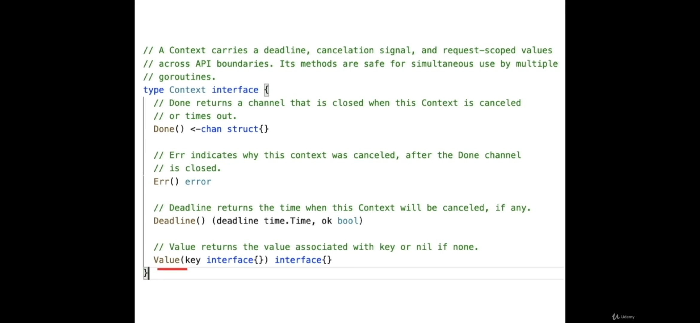

# Context در Go

زمانی که یک context لغو (cancel) شود، سیگنال آن به تمام contextهای فرزند ارسال می‌شود. نتیجه‌ی این کار می‌تواند آزادسازی منابع (reclaim resources)، متوقف کردن پردازه‌ها و جلوگیری از اجرای عملیاتی باشد که دیگر به آن‌ها نیازی نیست. همچنین می‌توان داده‌ها و metadata درخواست را به لایه‌های داخلی برد و مدیریت بهتری بر جریان داده داشت.  
توجه کنید که با لغو شدن هر context، فقط contextهای فرزند آن لغو می‌شوند. بنابراین مقدار context از نوع value است و در هر بار انتقال، یک کپی از آن ارسال می‌شود.

---

## Common Usages

### Managing Goroutines

زمانی که یک حلقه‌ی بی‌نهایت باید به شکل graceful خاتمه یابد یا فرمان deadline یا cancel برسد، از context برای کنترل گوروتین‌ها استفاده می‌شود.

```go
func longRunningTask(ctx context.Context) {
    for {
        select {
        case <-ctx.Done():
            fmt.Println("Task canceled")
            return
        default:
            // Do work
        }
    }
}
```

---

### Timeouts

در بخش‌هایی از برنامه مانند database یا network که احتمال تأخیر در پاسخ وجود دارد، می‌توان با context و timeout از قفل شدن برنامه جلوگیری کرد:

```go
func timeoutExample() {
    ctx, cancel := context.WithTimeout(context.Background(), 2*time.Second)
    defer cancel() // جلوگیری از نشت منابع (resource leak)

    done := make(chan struct{})
    go func() {
        defer close(done)
        select {
        case <-time.After(3 * time.Second):
            fmt.Println("Work completed")
        case <-ctx.Done():
            fmt.Println("Work timed out:", ctx.Err())
        }
    }()

    <-done
}
```

---

### Graceful Shutdown

زمانی که برنامه باید به صورت طبیعی خاموش شود، بهتر است به تمام فانکشن‌هایی که در حال اجرا هستند اطلاع دهیم تا با کمترین خسارت متوقف شوند.  

برای اطمینان از پیاده‌سازی درست graceful shutdown، در تمام عملیات‌های I/O و کانال‌ها باید سیگنال termination در نظر گرفته شود. همچنین در انتهای `main.go` بهتر است تعداد گوروتین‌های فعال چاپ شود؛ اگر عدد ۱ باشد یعنی همه به درستی بسته شده‌اند، در غیر این صورت هنوز گوروتینی فعال است.

```go
func main() {
    ctx, cancel := context.WithCancel(context.Background())
    sigChan := make(chan os.Signal, 1)
    signal.Notify(sigChan, syscall.SIGINT, syscall.SIGTERM)

    go longRunningTask(ctx)

    sig := <-sigChan
    fmt.Printf("Received signal: %s\n", sig)

    cancel()
    time.Sleep(5 * time.Second)
    fmt.Println("Shutting down gracefully")
}
```



---

## انواع Context

### context.WithCancel

برای زمانی که بخواهیم پردازشی را به صورت دستی متوقف کنیم.  
با فراخوانی cancel، تمام contextهای فرزند سیگنال دریافت می‌کنند و می‌توانند گوروتین‌های خود را خاتمه دهند. اگر cancel فراخوانی شود ولی فرزندان از `select ctx.Done()` استفاده نکنند، هیچ تأثیری نخواهد داشت.

---

### context.WithDeadline

ورودی آن یک زمان مشخص است و در واقع wrapperای روی `WithCancel` محسوب می‌شود.  
درون خود یک goroutine دارد که پس از رسیدن به زمان تعیین‌شده، `cancel()` را فراخوانی می‌کند.

---

### context.WithTimeout

این مورد نیز wrapperای بر `WithDeadline` است و به جای زمان مشخص، مدت زمان (duration) می‌گیرد. مقدار زمان داده‌شده با `time.Now()` جمع می‌شود و سپس `cancel()` اجرا می‌شود.

---

### context.WithValue

در این نوع context، می‌توان داده‌هایی را به صورت کلید-مقدار ذخیره کرد.  
کلید باید از نوع سازگار (compatible type) باشد و نمی‌توان از هر نوع دلخواهی استفاده کرد.  

از این روش می‌توان به‌جای متغیرهای سراسری (global variables) استفاده کرد، زیرا داده‌ها تنها برای context فعلی و فرزندان آن در دسترس خواهند بود.  
با این حال استفاده‌ی زیاد از آن ممکن است باعث ایجاد **Side Effects** و نوعی **Dependency Injection** ناخواسته شود.

---

### cancel()

حتماً باید بعد از اتمام کار فراخوانی شود تا از نشت حافظه (memory leak) جلوگیری شود.

---

## نکات کلی مربوط به Context

+ در تمام عملیات‌های I/O بهتر است context بررسی و timeout تنظیم شود.  
+ تمام فانکشن‌های داخلی باید در برابر لغو شدن (cancel) به‌درستی واکنش نشان دهند.  
+ از `context.TODO()` زمانی استفاده می‌شود که هنوز مشخص نیست چه contextی باید استفاده شود.  
+ نباید از `WithValue` برای ارسال داده‌های اختیاری (optional) استفاده کرد.

---

## استفاده از Context در HTTP Server

برای جلوگیری از حملات DDoS، مدیریت منابع و کنترل file descriptorها بهتر است از context استفاده شود.  

### Read Timeout

گاهی درخواست‌های مخرب باعث خواندن طولانی و سنگین داده‌ها می‌شوند. خواندن درخواست به بخش‌های کوچک تقسیم می‌شود که در تصویر قابل مشاهده است.
